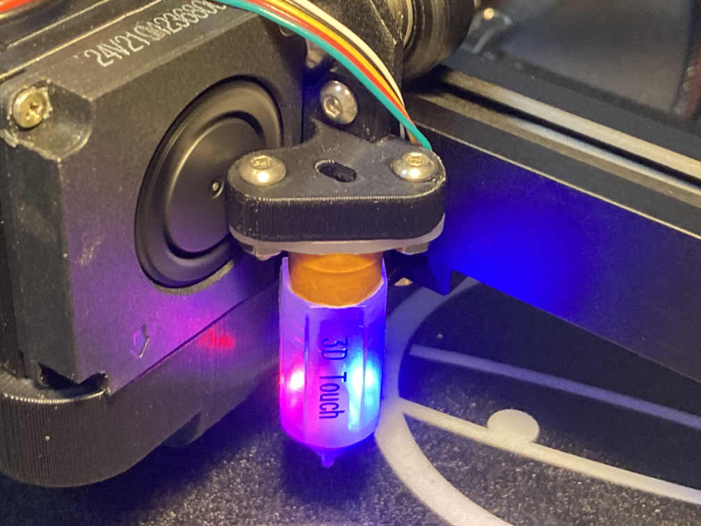

# Neptune2-practical-mods/BL-Touch-Mount

This is a practical BL-Touch mount for ELEGOO Neptune 2 series 3D printers.
It has zero Y offset, is highly stiffness and strength, and is compatible with the miniSatsana shroud.

## Highly accuracy

Highly stiffness provide improve accuracy bed level repeat detection.
Highly strength prevents deformation due to thermal stress.
The zero Y offset keeps the nozzle and the prove level even when the print head is lean forward by temperature transition.

## Settings

This mount has offset of X is 46.25 and offset of Y is 0.
You can setting up your printer by using elegoo.txt lines below and ELEGOO's standard procedure.

    >Z_PROBE_OFFSET_FROM_EXTRUDER	0	    # Z offset: -below +above  [the nozzle]		
    >X_PROBE_OFFSET_FROM_EXTRUDER	46.25	# X offset: -left  +right  [of the nozzle]
    >Y_PROBE_OFFSET_FROM_EXTRUDER	0	    # Y offset: -front +behind [the nozzle]

## Authors

marbocub - Initial work

## License

Copyright (c) 2022 marbocub marbocub@gmail.com, All rights reserved.

This project is licensed under the CC-BY-NC-SA 4.0 - see the [LICENSE](../LICENSE) file for details.
