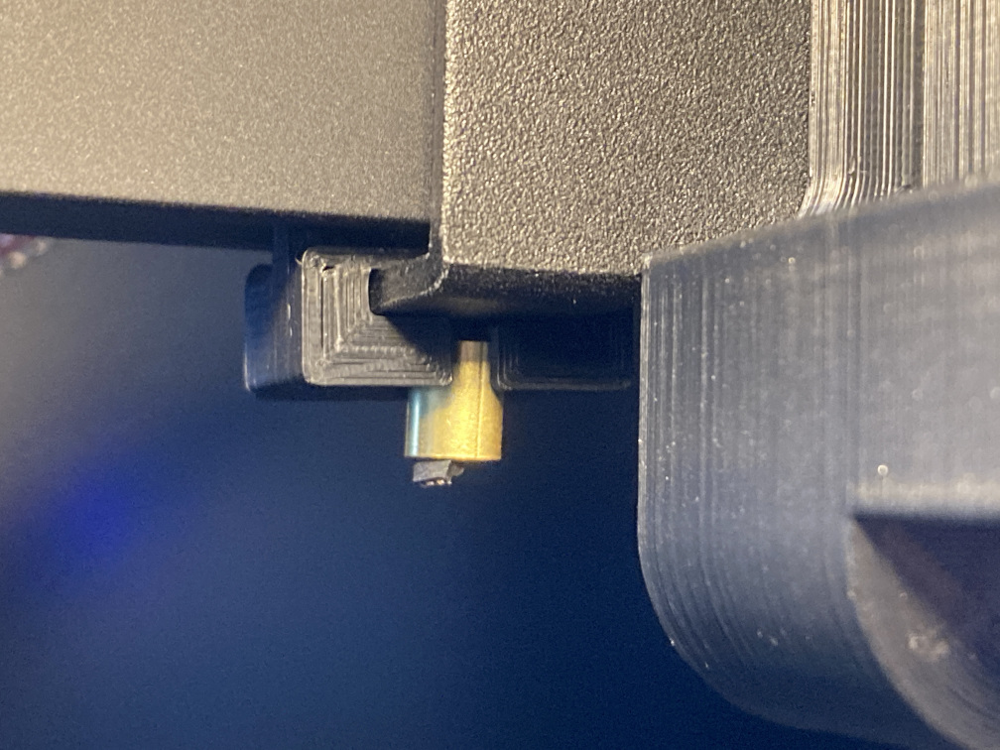

# Neptune2-practical-mods/X-Axis-Belt-Shim

This is an X-axis belt shim for ELEGOO Neptune 2 series 3D printers.
It makes X belt parallel to the X axis (gantry) and equalize the nozzle movement scale at the center of the bed and at the left/right sides of the bed.
Therefore, the accuracy of the printed model is improved.

|The shim|The shim installed on the toolhead|
|---|---|
|||

## The theory

If the belt is not parallel to the axis: $\Delta X_{in} \ne \Delta X_1$ and $\Delta X_2 \lt \Delta X_1$.

Correct belt parallel to the axis: $\Delta X_{in} = \Delta X_3$ and $\Delta X_4 = \Delta X_3$.

### Correcting belt path of Neptune 2 series

It is 5mm off at the stepper side and is 3.8mm off at the idler side.

## Installing

You can print and install two shims on the toolhead, one is stepper side the other is idler side.

|Stepper side|Idler side|
|---|---|
|||

## Authors

marbocub - Initial work

## License

Copyright (c) 2022 marbocub marbocub@gmail.com, All rights reserved.

This project is licensed under the CC-BY-NC-SA 4.0 - see the [LICENSE](../LICENSE) file for details.
